# Files API Early Upload Optimization Plan

## 🎯 **The Problem You Identified**

You're absolutely right! We're currently uploading images to the Files API **only during the final rendering stage**, but we should be uploading them **immediately after background removal** to optimize token usage across ALL pipeline stages.

## 📊 **Current Pipeline Flow (Inefficient)**


**Problem**: Analysis and Enrichment stages are **still resizing and processing large images** unnecessarily.

## 🚀 **Optimized Pipeline Flow (What We Should Do)**

```mermaid
flowchart TD
    A[Input Image 3.9MB] --> B[Background Removal - FAL.AI]
    B --> C[Cleaned Image URL]
    C --> D[🆕 Upload to Files API Immediately]
    D --> E[Analysis Stage - Uses Files API URI]
    E --> F[Enrichment Stage - Uses Files API URI]
    F --> G[Consolidation Stage]
    G --> H[Rendering Stage - Reuses existing Files API URI]
    
    style D fill:#99ff99
    style E fill:#99ff99
    style F fill:#99ff99
    style H fill:#99ff99
```



**Benefits**: All stages use the same optimized Files API URI, eliminating redundant resizing and token costs.

## 🔍 **Current Token Waste Analysis**

### **What's Happening Now:**
1. **Analysis Stage**: Downloads + resizes 12MB → 43KB (`prepareImageForGemini`)
2. **Enrichment Stage**: Downloads + resizes 12MB → 43KB (duplicate work!)
3. **Rendering Stage**: Downloads + optimizes + uploads to Files API

### **Token Cost Per Stage:**
```
Analysis:    ~43KB base64 = ~1,150 tokens
Enrichment:  ~43KB base64 = ~1,150 tokens  
Rendering:   Files API URI = ~20 tokens
Total:       ~2,320 tokens per image
```

## 💰 **With Early Files API Upload:**

```
All Stages:  Files API URI = ~20 tokens each
Total:       ~60 tokens per image
Savings:     97% token reduction!
```

## 🔧 **Implementation Plan**

### **Phase 1: Add Early Upload Function**

Create a new function in `lib/ghost/pipeline.ts`:

```typescript
/**
 * Upload cleaned image to Files API immediately after background removal
 */
private async uploadToFilesAPI(imageUrl: string, sessionId: string): Promise<string> {
  try {
    // Import Files API utilities
    const { uploadImageToFilesAPI } = await import('./files-manager');
    
    console.log('🔄 Uploading cleaned image to Files API for token optimization...');
    
    const filesApiUri = await uploadImageToFilesAPI(imageUrl, {
      sessionId,
      purpose: 'analysis-optimized',
      maxDimension: 1536 // Slightly higher res than current 1024px
    });
    
    console.log(`✅ Uploaded to Files API: ${filesApiUri}`);
    console.log('🎆 All subsequent stages will use optimized Files API URI');
    
    return filesApiUri;
    
  } catch (error) {
    console.warn('⚠️ Files API upload failed, stages will use URL fallback');
    return imageUrl; // Fallback to original URL
  }
}
```

### **Phase 2: Modify Pipeline Flow**

Update the pipeline in `pipeline.ts` to upload immediately after background removal:

```typescript
// Stage 1: Background Removal
const cleanedImageUrl = await removeBackground(request.flatlay);

// 🆕 Stage 1.5: Upload to Files API for token optimization
const optimizedImageReference = await this.uploadToFilesAPI(
  cleanedImageUrl, 
  this.state.sessionId
);

// Store both URLs for flexibility
this.state.stageResults.backgroundRemovalFlatlay = {
  cleanedImageUrl,           // Original FAL URL
  optimizedReference        // Files API URI
};

// Stage 2 & 3: Analysis and Enrichment use optimizedReference
const analysis = await analyzeGarment(optimizedImageReference, sessionId);
const enrichment = await analyzeGarmentEnrichment(optimizedImageReference, sessionId);
```

### **Phase 3: Update Analysis Functions**

Modify `gemini.ts` to handle Files API URIs natively:

```typescript
async function prepareImageForGemini(imageInput: string, maxDimension: number = 1024): Promise<string> {
  // 🆕 Check if it's already a Files API URI
  if (imageInput.startsWith('https://generativelanguage.googleapis.com/v1beta/files/')) {
    console.log('✅ Using existing Files API URI - no resizing needed');
    return imageInput; // Return as-is for Files API usage
  }
  
  // Original resizing logic for URLs/base64...
}
```

## 📈 **Expected Performance Impact**

### **Current Performance:**
- Analysis stage: 10.3s (includes image download + resize)
- Enrichment stage: 6.0s (includes image download + resize)
- Total redundant work: ~5-8 seconds per pipeline

### **With Early Upload:**
- **One-time upload**: +2-3 seconds after background removal
- **Analysis stage**: 7-8s (no image processing needed)
- **Enrichment stage**: 3-4s (no image processing needed)
- **Net speedup**: 3-5 seconds per pipeline
- **Token savings**: 97% reduction

## 🚨 **Risk Mitigation**

### **Fallback Strategy:**
```typescript
// Always provide fallback to current method
const imageReference = this.state.stageResults.backgroundRemovalFlatlay?.optimizedReference 
                    || this.state.stageResults.backgroundRemovalFlatlay?.cleanedImageUrl;
```

### **Gradual Rollout:**
1. **Phase 1**: Add upload function with fallback
2. **Phase 2**: Test on development environment
3. **Phase 3**: Enable via environment flag
4. **Phase 4**: Make default after validation

## 🎯 **Implementation Steps**

### **Step 1: Create Files API Helper** ✅ (Already exists)
- `lib/ghost/files-manager.ts` already has upload functions

### **Step 2: Add Early Upload to Pipeline**
```bash
# Modify pipeline.ts to add upload after background removal
# Location: Line ~180 after background removal completion
```

### **Step 3: Update Analysis Functions**
```bash
# Modify gemini.ts to handle Files API URIs efficiently
# Location: prepareImageForGemini function
```

### **Step 4: Add Environment Flag**
```bash
# Add to .env.example
ENABLE_EARLY_FILES_UPLOAD=true
```

## 🏆 **Expected Results**

### **Performance:**
- ✅ **3-5 second speedup** per pipeline
- ✅ **97% token reduction** for image processing
- ✅ **No redundant image downloads** across stages

### **Cost:**
- ✅ **Dramatic cost reduction** on image tokens
- ✅ **Minimal Files API storage cost** (pennies)
- ✅ **Better quota management** (fewer tokens per request)

### **Reliability:**
- ✅ **Reduced network calls** (single upload vs. multiple downloads)
- ✅ **Consistent image quality** across all stages
- ✅ **Graceful fallback** if Files API fails

## 🚀 **Priority: HIGH**

This optimization addresses exactly what you identified - we're doing unnecessary work by not uploading to Files API early enough. The implementation is straightforward and the benefits are substantial.

**Should we implement this optimization?** It's a clear win for performance, cost, and maintainability.

---

*Generated: ${new Date().toISOString()}*